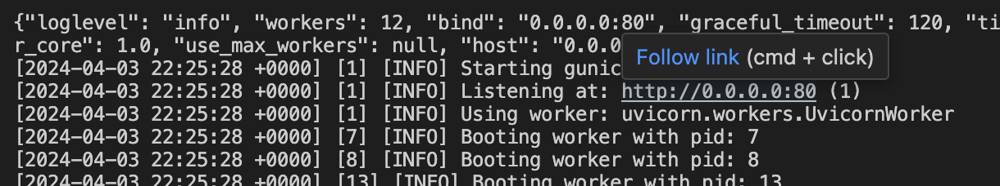
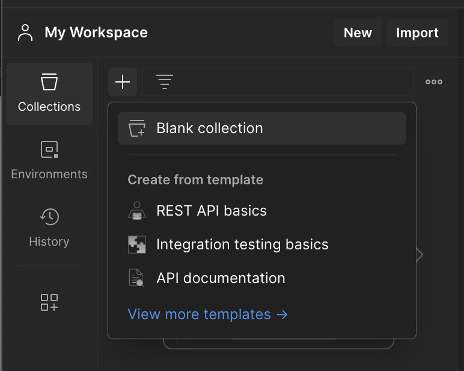
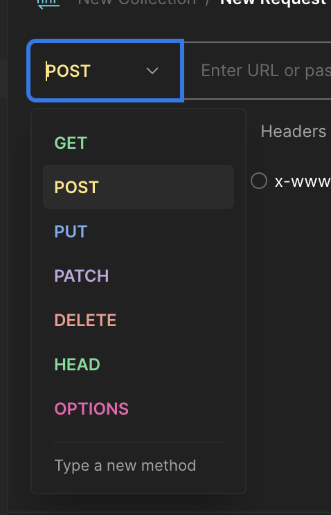
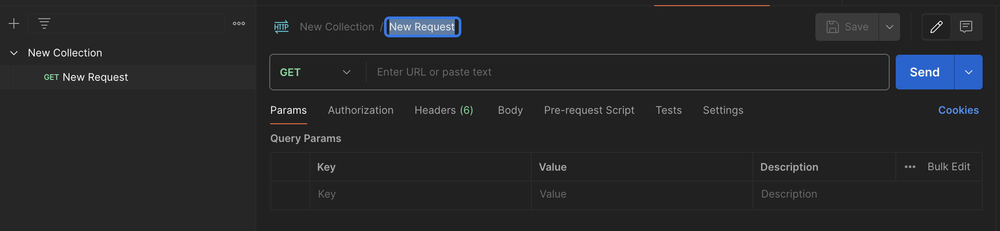
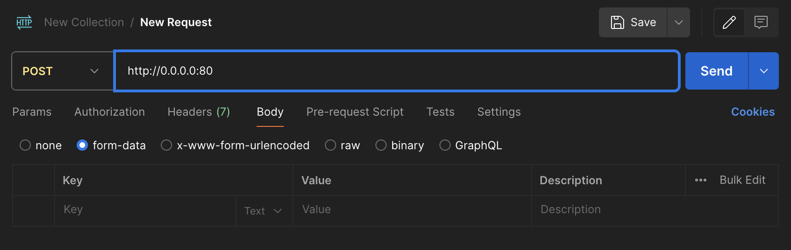

# AgnosticAPI

To run, you will need:
1. **Docker** https://www.docker.com/products/docker-desktop
    Optional: Create DockerHub account to save and manage your images and containers.
2. **Postman** https://www.postman.com/downloads/
    This will allow you to send and receive requests with the API. You will need to create an account through your institution. 

Navigate to your AgnosticAPI directory and run the code below in your terminal:

```
docker build -t mobile-net-app .
docker run -p 80:80 mobile-net-app
```

1. Copy URL output from Terminal: 
2. In postman, create a new collection: 
3. Add a request, change to a POST request: 
4. Navigate to Body tab: 
5. Paste your http address in the field next to POST and add `/predict`:  This calls the prediction function in the main.py file.
6. Change dropdown menu from `Text ` to `File` and then upload a JPEG file from your local directory. 

Then in postman, set the url to: http://localhost:80

In postman, create a new POST request
set the url to: http://localhost:80/predict
Click on the Body tab
Select form-data as the body type
Add a key named file (matches the parameter name in the FastAPI function)
Click Browse and select the image file you want to classify
Click the Send button to send the POST request with the image
